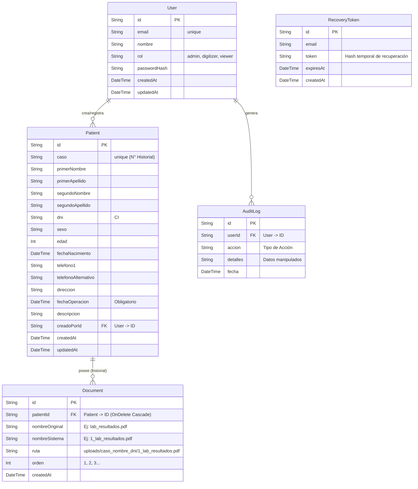
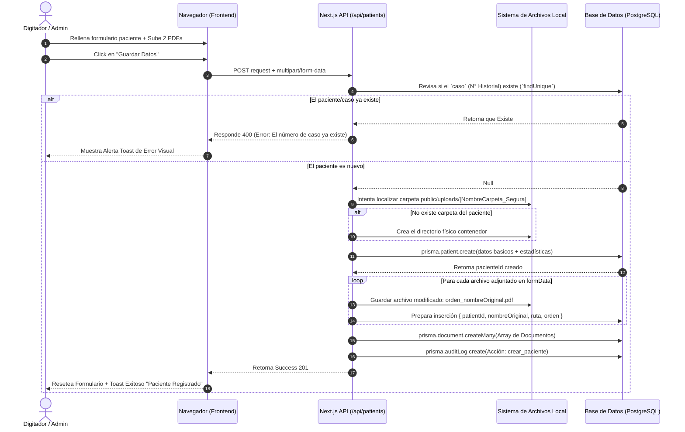

# Documentación de Arquitectura y Base de Datos - SPS Health

A continuación se presentan los diagramas lógicos que definen la estructura de datos y el comportamiento central (Gestión de Pacientes) del sistema clínico.

Los diagramas están desarrollados bajo el estándar gráfico [Mermaid](https://mermaid.js.org/).

## 1. Diagrama de Entidad Relación (ER)

El siguiente modelo visualiza las entidades principales en PostgreSQL y cómo se anidan o interactúan.

---

## 2. Diagrama de Secuencia

Este diagrama especifica el flujo técnico e interactivo que sucede bajo el capó cuando un Funcionario decide **Añadir un Nuevo Paciente con documentos y archivos físicos**.

